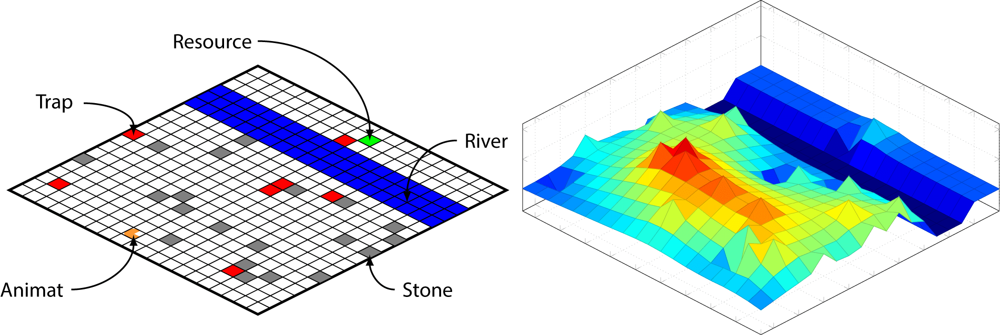

# HyperNEAT Environment - River Crossing Task



This repo contains a HyperNEAT experiment to produce an activity potential field, known as the Shunting Model, in a reactive and deliberate task, known as the River Crossing Task (RC task). 

The details of the RC task and the Shunting Model can be found in 'Neuroevolution of Agents Capable of Reactive and Deliberative Behaviours in Novel and Dynamic Environments' (see links section). 

The paper associated with this work can be found below:

[1] [Toward evolving robust, deliberate motion planning with HyperNEAT](http://www.channon.net/alastair/papers/ieeeALife2017alt.pdf)


## Prerequisites

This repo is an add-on to Jason Gauci's [HyperNEAT v4.0 for C++](https://github.com/MisterTea/HyperNEAT); a running version of that code is needed.

## Getting started

An `install.sh` is provided and makes the appropriate changes to `HyperNEAT v4.0` for the RC Task environment. Each experiment has a static environment number reference (see `Hypercube_NEAT/include/HCUBE_Defines.h`), this environment occupies number `30`. 

Note: If additional environments have been implemented on top of the base code, this may not work. This was only tested on the base code.

## Installing

To start the installation, navigate to the folder and type:

```shell
./install.sh
```

At which point, there is a prompt for the HyperNEAT folder location:

```shell
HyperNEAT root location:
```

This should reference the root location of `HyperNEAT v4.0`. 

Provided this was successful, files will be transferred to the correct directories and a patch applied to update existing files. Build instructions can then be followed at [Jason Gauci's repo](https://github.com/MisterTea/HyperNEAT/blob/master/README).

Reference the file below to begin the experiment:

```shell
HyperNEAT/NE/HyperNEAT/out/data/RiverExperiment.dat
```

## Usage

The file `RiverExperiment.dat` contains the parameters used in 'Toward evolving robust, deliberate motion planning with HyperNEAT'. These can be changed to suit preference.

## Links

- [Neuroevolution of Agents Capable of Reactive and Deliberative Behaviours in Novel and Dynamic Environments](http://eprints.keele.ac.uk/30/1/Neuroevolution%20of%20agents%20capable%20of%20reactive%20and%20deliberative%20behaviours%20in%20novel%20and%20dynamic%20environments%20%28AChannon%29.pdf)
- [Toward evolving robust, deliberate motion planning with HyperNEAT](http://www.channon.net/alastair/papers/ieeeALife2017alt.pdf)
- [Generating large-scale neural networks through discovering geometric regularities](http://citeseerx.ist.psu.edu/viewdoc/download?doi=10.1.1.103.2950&rep=rep1&type=pdf)
- [HyperNEAT v4.0 C++ By Jason Gauci](https://github.com/MisterTea/HyperNEAT)